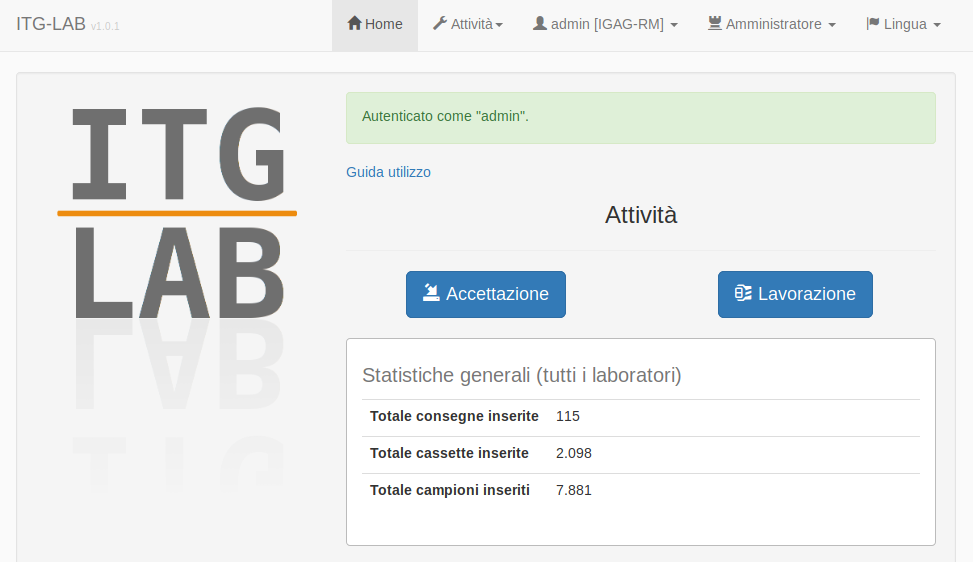
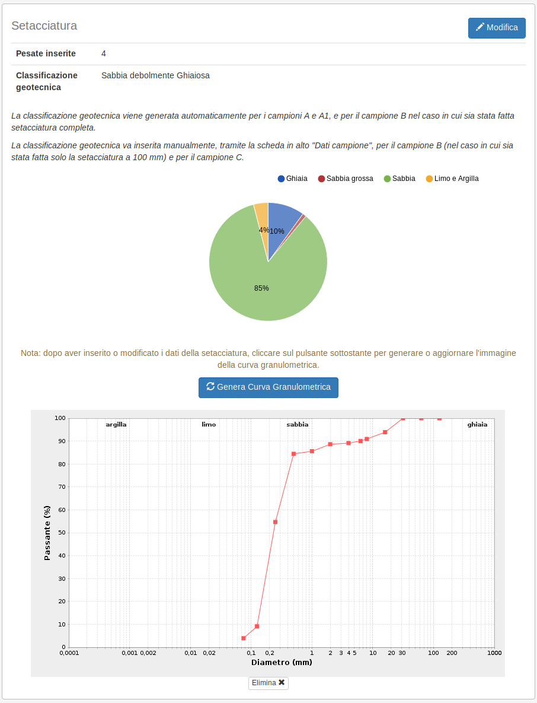

Custom web application for the management of geotechnical laboratory tests on road materials samples.

The application was developed using [JHipster](https://www.jhipster.tech/) 3 and includes:

- PostgreSQL database
- Spring Boot
- Maven configuration for building, testing and running the application
- development and production profiles
- Spring Security
- Spring MVC REST + Jackson
- Spring Data JPA
- Liquibase
- Elasticsearch
- JasperReports library for pdf reports
- Apache POI for Excel files import/export
- JFreeChart for charts generation
- Logback logging
- AngularJS (frontend)
- Twitter Bootstrap (frontend)

[User guide](src/main/webapp/content/guida.md)

## Development with JHipster

Before you can build this project, you must install and configure the following dependencies on your machine:

1. [Node.js][]: We use Node to run a development web server and build the project.
   Depending on your system, you can install Node either from source or as a pre-packaged bundle.

After installing Node, you should be able to run the following command to install development tools (like
[Bower][] and [BrowserSync][]). You will only need to run this command when dependencies change in package.json.

    npm install

We use [Gulp][] as our build system. Install the Gulp command-line tool globally with:

    npm install -g gulp

Run the following commands in two separate terminals to create a blissful development experience where your browser
auto-refreshes when files change on your hard drive.

    ./mvnw
    gulp

Bower is used to manage CSS and JavaScript dependencies used in this application. You can upgrade dependencies by
specifying a newer version in `bower.json`. You can also run `bower update` and `bower install` to manage dependencies.
Add the `-h` flag on any command to see how you can use it. For example, `bower update -h`.

## Building for production

To optimize the italgaslab client for production, run:

    ./mvnw -Pprod clean package -DskipTests

This will concatenate and minify CSS and JavaScript files. It will also modify `index.html` so it references
these new files.

To ensure everything worked, run:

    java -jar target/*.war --spring.profiles.active=prod

Then navigate to [http://localhost:8080](http://localhost:8080) in your browser.

[Node.js]: https://nodejs.org/
[Bower]: http://bower.io/
[Gulp]: http://gulpjs.com/
[BrowserSync]: http://www.browsersync.io/
