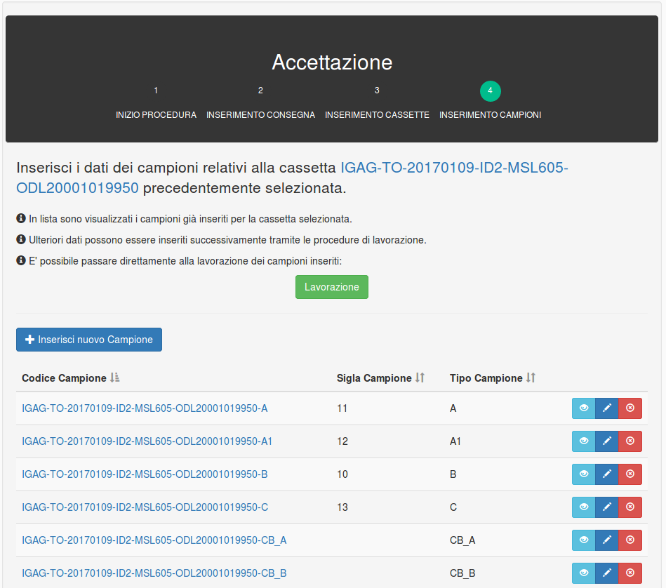
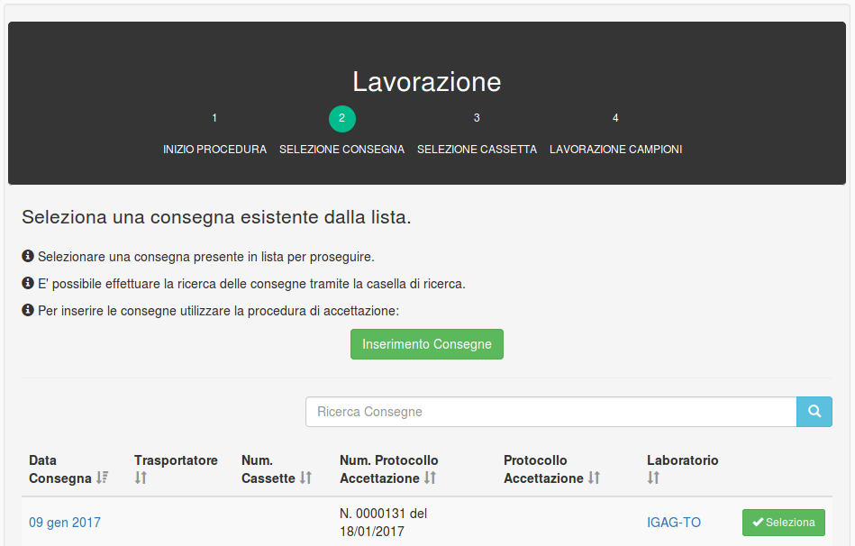
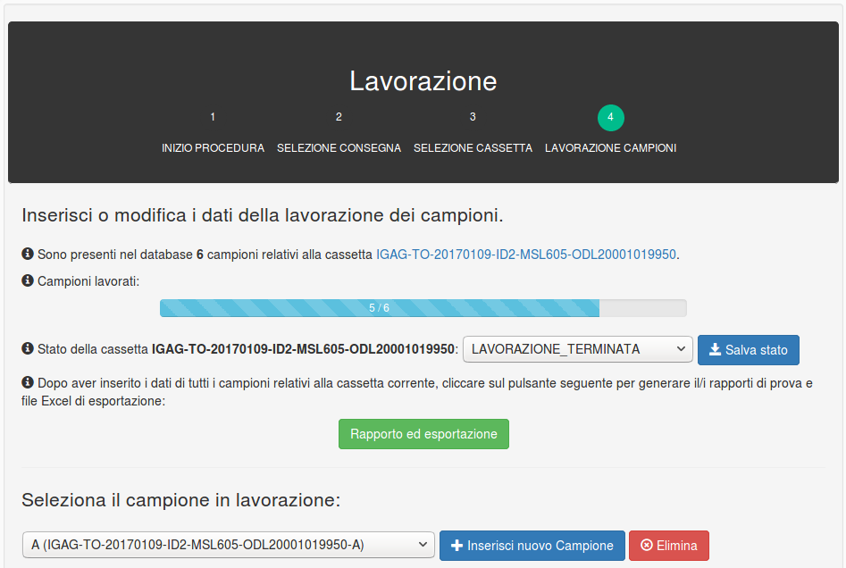
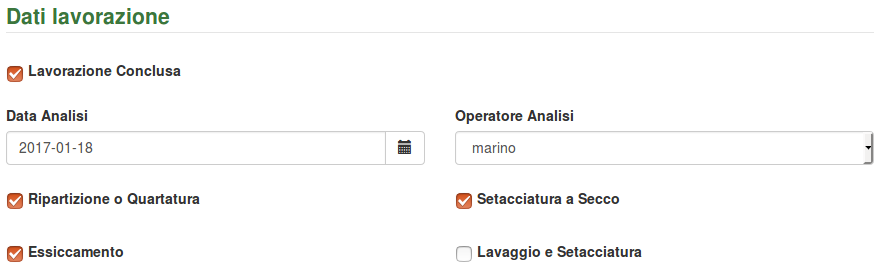
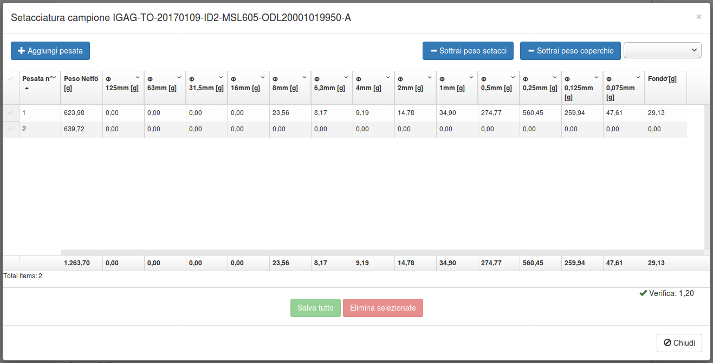
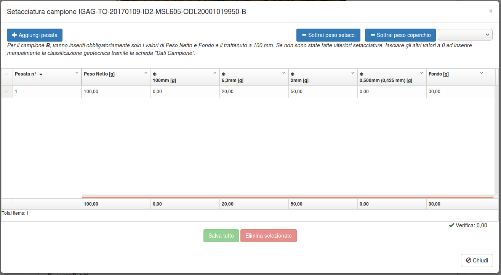
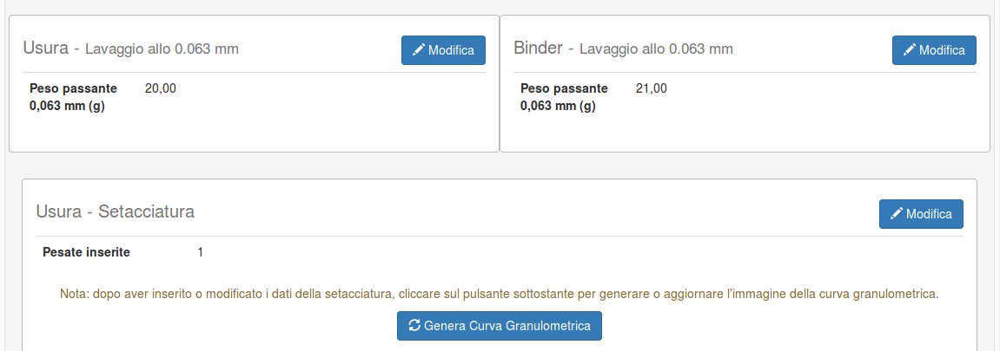

# ITG-LAB - Guida utilizzo

<!-- toc orderedList:0 depthFrom:2 depthTo:6 -->

* [Accesso ed utenze](#accesso-ed-utenze)
* [Attività principali](#attività-principali)
* [Accettazione](#accettazione)
    * [1° step: Inizio procedura](#1-step-inizio-procedura)
    * [2° step: Inserimento dati della consegna](#2-step-inserimento-dati-della-consegna)
    * [3° step: Inserimento dati delle cassette](#3-step-inserimento-dati-delle-cassette)
    * [4° step: Inserimento dati dei campioni](#4-step-inserimento-dati-dei-campioni)
* [Lavorazione](#lavorazione)
    * [1° step: Inizio procedura](#1-step-inizio-procedura-1)
    * [2° step: Selezione della consegna](#2-step-selezione-della-consegna)
    * [3° step: Selezione della cassetta](#3-step-selezione-della-cassetta)
    * [4° step: Lavorazione dei campioni](#4-step-lavorazione-dei-campioni)
    * [Operatore analisi](#operatore-analisi)
    * [Lavorazione dei campioni A e A1](#lavorazione-dei-campioni-a-e-a1)
        * [Dati campione](#dati-campione)
        * [Pesatura](#pesatura)
        * [Setacciatura](#setacciatura)
    * [Lavorazione del campione B](#lavorazione-del-campione-b)
    * [Lavorazione del campione C](#lavorazione-del-campione-c)
    * [Lavorazione campioni CB_A e CB_B](#lavorazione-campioni-cb_a-e-cb_b)
* [Generazione rapporti e file di esportazione](#generazione-rapporti-e-file-di-esportazione)

<!-- tocstop -->

## Accesso ed utenze

Per accedere al sito è necessario avere un **account** registrato associato ad uno dei laboratori che partecipano al progetto.

Per accedere, cliccare su `login` oppure selezionare il menu `Utente - Accesso`.

Una volta effettuato l'accesso con la password iniziale, è **indispensabile impostare la propria password personale** tramite il menu `Utente - Password`.

## Attività principali

Le attività principali, raggiungibili tramite i pulsanti posti nella home o tramite il menu `Attività`, si dividono in:

* **Accettazione**
* **Lavorazione**

Sono presenti inoltre le voci:

* Registrazione teglie
* Registrazione setacci

per inserire i dati di peso di teglie, setacci e coperchi utilizzati. In questo modo sarà possibile sottrarre automaticamente questi valori dalle pesate effettuate sui campioni.

## Accettazione

La procedura di **Accettazione** permette di:

1. Inserire i dati relativi ad una **consegna**
2. Inserire i dati relativi alle **cassette** consegnate
3. Inserire alcuni dati principali relativi ai **campioni** contenuti in ogni cassetta.

La procedura è guidata e suddivisa in step successivi:

### 1° step: Inizio procedura

### 2° step: Inserimento dati della consegna

Per inserire una nuova consegna, cliccare sul pulsante `Inserisci nuova Consegna`.

Se la consegna è già stata inserita e si vuole procedere all'inserimento di cassette e campioni, **selezionare una consegna** presente nella lista cliccando sul pulsante verde `Seleziona`.

> In tutte le **liste** i dati vengono visualizzati in "pagine" (gruppi di 20). Per visualizzare la pagina precedete o successiva, utilizzare i pulsanti `Pag. precedente` e `Pag. successiva` posti in fondo alla lista.

E' possibile:

* **Visualizzare i dati della consegna** cliccando sul primo pulsante celeste sulla destra di una delle consegna in lista;
* **Modificare** i dati già inseriti cliccando sul pulsante blu con un simbolo "matita";
* **Eliminare** una consegna cliccando sul pulsante rosso.

Nota: **Eliminare** una consegna comporta l'eliminazione di tutte le cassette, i campioni e i dati di lavorazione associati.

Selezionando tramite il pulsante verde una consegna, si accede allo step successivo.

### 3° step: Inserimento dati delle cassette

Per inserire una nuova cassetta, cliccare sul pulsante `Inserisci nuova Cassetta`.

> **Codice cassetta**: una volta salvata, alla cassetta viene assegnato automaticamente un codice composto in questo modo: `[laboratorio di appartenenza]-[data consegna]-[id del database]-[mslink (rif. geografo)]-[odl (ods)]`.
> Ad esempio: `IGAG-TO-20170109-ID2-MSL605-ODL20001019950`

Se la cassetta è già stata inserita e si vuole procedere all'inserimento dei campioni, **selezionare una cassetta** presente nella lista cliccando sul pulsante verde `Seleziona`.

> In tutte le **liste** i dati vengono visualizzati in "pagine" (gruppi di 20). Per visualizzare la pagina precedete o successiva, utilizzare i pulsanti `Pag. precedente` e `Pag. successiva` posti in fondo alla lista.

E' possibile:

* **Visualizzare i dati della cassetta** cliccando sul primo pulsante celeste sulla destra di una delle cassette in lista;
* **Modificare** i dati già inseriti cliccando sul pulsante blu con un simbolo "matita";
* **Eliminare** una cassetta cliccando sul pulsante rosso.

Nota: **Eliminare** una cassetta comporta l'eliminazione di tutte i campioni e i dati di lavorazione associati.

Selezionando tramite il pulsante verde una cassetta, si accede allo step successivo.

### 4° step: Inserimento dati dei campioni

Per inserire una nuovo campione, cliccare sul pulsante `Inserisci nuovo Campione`. I dati dei campioni inseriti in questa fase sono solo quelli di base. I dati di **lavorazione** dei campioni vengono inseriti tramite la procedura di lavorazione.

Il pulsante verde `Lavorazione` permette di accedere direttamente allo step finale della procedura di lavorazione senza passare attraverso la selezione della consegna e della cassetta cui appartengono i campioni.

> **Codice campione**: una volta salvato, al campione viene assegnato automaticamente un codice composto in questo modo: `[codice cassetta]-[tipo campione]`.
> Ad esempio: `IGAG-TO-20170109-ID2-MSL605-ODL20001019950-A1`

## Lavorazione

La procedura di lavorazione permette di inserire i dati di lavorazione relativi ai campioni. Prima di inserire i dati di lavorazione dei campioni è necessario selezionare nel database la **Consegna** e la **Cassetta** cui appartengono i campioni lavorati.

### 1° step: Inizio procedura

### 2° step: Selezione della consegna

Nella procedura di lavorazione, è necessario in primo luogo **selezionare** la consegna già inserita. Sono assenti in questo caso i pulsanti di inserimento, modifica e cancellazione, che riguardano la procedura di **accettazione**.

> In tutte le **liste** i dati vengono visualizzati in "pagine" (gruppi di 20). Per visualizzare la pagina precedete o successiva, utilizzare i pulsanti `Pag. precedente` e `Pag. successiva` posti in fondo alla lista.

Selezionando tramite il pulsante verde `Seleziona` una consegna, si accede allo step successivo.

### 3° step: Selezione della cassetta

In questo step viene selezionata la cassetta già inserita contenente i campioni in lavorazione. Sono assenti in questo caso i pulsanti di inserimento, modifica e cancellazione, che riguardano la procedura di **accettazione**.

Selezionando tramite il pulsante verde `Seleziona` una cassetta, si accede allo step successivo.

### 4° step: Lavorazione dei campioni

In questo step vengono inseriti i dati di lavorazione di tutti i campioni relativi alla cassetta selezionata nel precedente step.

La selezione del campione corrente avviene tramite il menu a tendina `Seleziona il campione in lavorazione`. A seconda della tipologia di campione selezionata, il resto della pagina conterrà elementi differenti:

* Campione **A, A1, B**: la pagina conterrà le sezioni:
    * `Dati campione`
    * `Pesatura`
    * `Setacciatura`
* Campione **C**: la pagina conterrà la sezione:
    * `Dati campione`
* Campioni **CB_A, CB_B**: la pagina conterrà le sezioni:
    * `Dati campione`
    * `Spessore` (suddiviso per usura e binder)
    * `Massa Volumica Apparente - Superficie Satura Secca (SSD)` (suddiviso per usura e binder)
    * `Percentuale di legante` (suddiviso per usura e binder)
    * `Massa Volumica dei granuli dell'aggregato` (suddiviso per usura e binder)
    * `Percentuale dei vuoti` (suddiviso per usura e binder)
    * `Lavaggio allo 0.063 mm` (suddiviso per usura e binder)
    * `Setacciatura` (usura)
    * `Setacciatura` (binder)

In ogni sezione è presente un pulsante `Modifica` per inserire e modificare i dati di lavorazione.

### Operatore analisi

Per tutti i tipi di campione, nella sezione `Dati di lavorazione` dell'interfaccia di inserimento vengono inseriti dati quali la data dell'analisi e l'operatore che esegue l'analisi.

Per quanto riguarda l'**operatore**, è possibile selezionarne uno tramite il menu a tendina *fra quelli registrati per il laboratorio corrente*, ma è anche possibile inserire **uno o più nomi di operatori non registrati** tramite le note, secondo le modalità descritte:

Lasciando vuoto il campo `Operatore Analisi` ed inserendo il/i nomi nelle note come illustrato, nel **rapporto di prova** verrà inserito, come operatore che ha eseguito l'analisi, "Mario Rossi".

### Lavorazione dei campioni A e A1

#### Dati campione

L'inserimento dei dati del campione avviene selezionando il pulsante `Modifica` della sezione `Dati campione`.

#### Pesatura

L'inserimento dei dati avviene in modo simile a quanto avviene nel file Excel.

E' possibile inserire manualmente il peso della teglia (tara) oppure selezionare una delle teglie inserite nella sezione `Registrazione teglie`.

#### Setacciatura

Per inserire i dati di setacciatura, cliccare sul pulsante `Modifica`.

Per inserire una serie di pesate, utilizzare il pulsante `Aggiungi pesata` e riempire le celle.

E' possibile sottrarre automaticamente dai valori inseriti i pesi dei setacci e/o dei coperchi inseriti nella sezione `Registrazione setacci`, tramite i pulsanti `Sottrai peso setacci` e `Sottrai peso coperchio`.

Una volta inserite le setacciature, la **classificazione geotecnica** viene generata *automaticamente* per i campioni **A** e **A1**, e per il campione **B nel caso in cui sia stata fatta setacciatura completa**.

La classificazione geotecnica va invece inserita *manualmente*, tramite la scheda in alto "Dati campione", per il campione **B (nel caso in cui sia stata fatta solo la setacciatura a 100 mm)** e per il campione **C**.

Per generare o aggiornare la **curva granulometrica**, cliccare sul pulsante `Genera curva granulometrica`.

### Lavorazione del campione B

Il campione **B** si distingue da A e A1 per la fase di setacciatura:

In questo caso, vanno inseriti obbligatoriamente solo i valori di **Peso Netto** e **Fondo** e il **trattenuto a 100 mm**. Se non sono state fatte ulteriori setacciature, lasciare gli altri valori a 0 ed inserire manualmente la classificazione geotecnica tramite la scheda "Dati Campione".

### Lavorazione del campione C

Per il campione C non sono presenti le sezioni `Pesatura` e `Setacciatura`.

La **classificazione geotecnica** va inserita manualmente nell'apposito campo durante l'inserimento dei `Dati campione`.

### Lavorazione campioni CB_A e CB_B

Per i campioni di conglomerato (CB_A e CB_B), sono presenti diverse sezioni, suddivise a loro volta per **Usura** e **Binder**.

L'inserimento dei dati per ogni sezione avviene in modo simile al file Excel.

L'inserimento delle setacciature e la generazione delle curve granulometriche avviene in modo simile ai campioni A e A1, a parte i diversi diametri dei setacci.

## Generazione rapporti e file di esportazione

Nella pagina di lavorazione dei campioni, dopo aver inserito i dati di tutti i campioni relativi alla cassetta corrente, cliccare sul pulsante `Rapporto ed esportazione` per generare il/i rapporti di prova e file Excel di esportazione.

Verrà scaricato un file **.zip** contenente:

* Rapporto di prova per i campioni A, A1, B, C
* Rapporto di prova campione CB_A (se presente)
* Rapporto di prova campione CB_B (se presente)
* File Excel contenente i dati inseriti ed utilizzabile da parte di Italgas per l'estrazione di informazioni. **Il file Excel contiene tutti i dati tranne le foto ed i segni di spunta**.

Esempio di contenuto dell'archivio **zip**:

